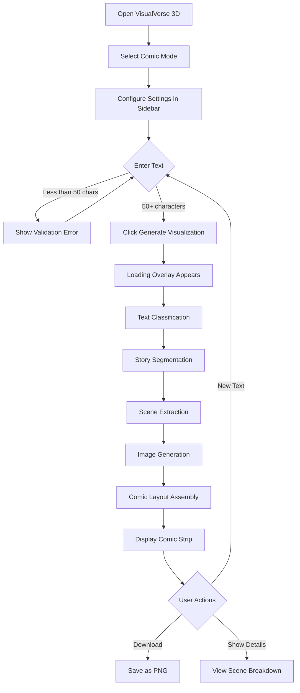
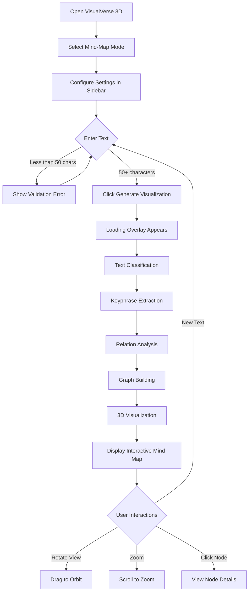

# VisualVerse 3D - User Documentation

**Version:** 1.0.0  
**Platform:** Desktop Application (Windows/Mac/Linux)  
**Technology:** Electron + React + Three.js + Python (FastAPI)

---

## 📖 Overview

VisualVerse 3D is a premium desktop application that transforms text into visual representations. It offers two powerful modes:

1. **Comic Mode** - Converts narrative stories into visual comic strips with AI-generated panels
2. **Mind-Map Mode** - Transforms informational text into interactive 3D concept maps

The application features a stunning 3D animated background with particle effects, glassmorphism UI design, and seamless integration with a Python-based NLP backend.

---

## 🚀 Quick Start

### Prerequisites
- Node.js 18+ installed
- Python 3.9+ with pip
- CUDA-compatible GPU (optional, for AI image generation)

### Installation

```bash
# Navigate to the desktop app directory
cd desktop-app

# Install Node dependencies
npm install --legacy-peer-deps

# Install Python dependencies (from project root)
cd ..
pip install -r requirements.txt

# Download spaCy model
python -m spacy download en_core_web_sm
```

### Running the Application

```bash
cd desktop-app

# Development mode (with hot reload)
npm run electron:dev

# Production build
npm run dist
```

---

## 🎨 User Interface Overview

### Application Layout

```
┌─────────────────────────────────────────────────────────────┐
│                    Native Window Controls                     │
├───────────────┬─────────────────────────────────────────────┤
│               │                                               │
│   SIDEBAR     │              MAIN CONTENT                     │
│               │                                               │
│ ┌───────────┐ │  ┌─────────────────┬─────────────────────┐   │
│ │ App Title │ │  │   INPUT PANEL   │    OUTPUT PANEL     │   │
│ │ Status    │ │  │                 │                     │   │
│ ├───────────┤ │  │  Mode Selector  │   Comic Display     │   │
│ │  Comic    │ │  │  Text Area      │       OR            │   │
│ │  Settings │ │  │  Generate Btn   │   Mind-Map View     │   │
│ ├───────────┤ │  │  Classification │                     │   │
│ │ Mind-Map  │ │  │                 │                     │   │
│ │  Settings │ │  └─────────────────┴─────────────────────┘   │
│ └───────────┘ │                                               │
├───────────────┴─────────────────────────────────────────────┤
│              3D ANIMATED PARTICLE BACKGROUND                 │
└─────────────────────────────────────────────────────────────┘
```

### Components Description

| Component | Description |
|-----------|-------------|
| **3D Background** | Animated particle nebula with floating wireframe geometries |
| **Sidebar** | Settings panel with Comic and Mind-Map configuration |
| **Mode Selector** | Toggle between Comic and Mind-Map visualization |
| **Text Input** | Area to enter or paste text (minimum 50 characters) |
| **Generate Button** | Triggers the visualization generation |
| **Output Panel** | Displays generated comic strips or 3D mind maps |

---

## 📚 User Flows

### Flow 1: Generate a Comic Strip



#### Step-by-Step Instructions:

1. **Launch the Application**
   - Run `npm run electron:dev` from the desktop-app directory
   - Wait for the window to appear (~2-3 seconds)

2. **Select Comic Mode**
   - Click the "🎨 Comic" option in the Mode Selector
   - The option will highlight with a pink glow

3. **Configure Comic Settings** (Sidebar)
   - **Art Style**: Choose from Western, Cartoon, Manga, or Realistic
   - **AI Model**: Select DreamShaper (best), Cartoon, or SD1.5
   - **Max Panels**: Slide to set 2-6 panels
   - **Use Placeholder**: Check for quick preview without AI generation

4. **Enter Your Story**
   - Type or paste a narrative story (minimum 50 characters)
   - Use "📖 Story Sample" button to load example text
   - Character count displays at bottom of text area

5. **Generate Comic**
   - Click "🚀 Generate Visualization" button
   - Watch the progress bar during generation
   - Loading overlay shows current processing step

6. **View Results**
   - Comic strip displays in the Output Panel
   - Click "📋 Show Details" to see scene breakdown
   - Click "⬇️ Download" to save as PNG

---

### Flow 2: Generate a Mind Map



#### Step-by-Step Instructions:

1. **Select Mind-Map Mode**
   - Click the "🧠 Mind-Map" option in the Mode Selector
   - The option will highlight with a cyan glow

2. **Configure Mind-Map Settings** (Sidebar)
   - **Max Keywords**: Slide to set 5-25 keywords
   - **Theme**: Choose Dark or Light

3. **Enter Informational Text**
   - Type or paste educational/technical content
   - Use "📚 Info Sample" button to load example text
   - Works best with structured, concept-rich text

4. **Generate Mind Map**
   - Click "🚀 Generate Visualization" button
   - Processing shows: Keyphrase extraction → Relation analysis → Graph building

5. **Interact with 3D Mind Map**
   - **Rotate**: Click and drag to orbit around the map
   - **Zoom**: Scroll wheel to zoom in/out
   - **Auto-Rotate**: Map slowly rotates automatically
   - **Click Node**: Shows node details panel
   - **Legend**: Color coding explained at bottom

---

## ⚙️ Settings Reference

### Comic Settings

| Setting | Options | Description |
|---------|---------|-------------|
| **Art Style** | Western, Cartoon, Manga, Realistic | Visual style for comic panels |
| **AI Model** | DreamShaper, Cartoon, SD1.5 | Image generation model |
| **Max Panels** | 2-6 | Maximum number of panels to generate |
| **Use Placeholder** | On/Off | Skip AI generation for quick previews |

### Mind-Map Settings

| Setting | Options | Description |
|---------|---------|-------------|
| **Max Keywords** | 5-25 | Maximum concepts to extract |
| **Theme** | Dark, Light | Color theme for visualization |

---

## 🔌 Backend Connection

### Status Indicator

The sidebar shows backend connection status:

| Status | Indicator | Meaning |
|--------|-----------|---------|
| **Online** | 🟢 Green dot | Backend connected and ready |
| **Offline** | 🔴 Red dot | Backend not running |
| **Processing** | 🔵 Blue dot (pulsing) | Request in progress |

### Troubleshooting Connection Issues

1. **Backend not starting automatically?**
   ```bash
   # Start manually from project root
   cd c:\Bavesh\Sem6\NLP\Visual-Verse
   python -m uvicorn api.routes:app --host localhost --port 8000 --reload
   ```

2. **Port 8000 already in use?**
   ```bash
   # Kill existing process
   netstat -ano | findstr :8000
   taskkill /PID <PID> /F
   ```

---

## 🎮 Keyboard Shortcuts

| Key | Action |
|-----|--------|
| `Ctrl + Enter` | Generate visualization (when text area focused) |
| `Ctrl + 1` | Switch to Comic mode |
| `Ctrl + 2` | Switch to Mind-Map mode |

---

## 🎨 Visual Features

### 3D Animated Background

The app features a stunning 3D background created with Three.js:

- **Particle Nebula**: ~8,500 color-shifting particles
- **Floating Geometries**: Wireframe icosahedron, octahedron, and torus
- **Mouse Parallax**: Background responds to mouse movement
- **Post-Processing**: Bloom, vignette, and chromatic aberration effects

### Glassmorphism UI Design

- Translucent panels with blur effects
- Glowing borders and accents
- Gradient color scheme: Cyan (#00f5ff) → Purple (#b829ff) → Pink (#ff2d7a)
- Animated hover states and transitions

---

## 📁 Project Structure

```
Visual-Verse/
├── desktop-app/                 # Electron desktop application
│   ├── electron/
│   │   ├── main.js             # Electron main process
│   │   └── preload.js          # IPC bridge
│   ├── src/
│   │   ├── components/
│   │   │   ├── Background3D/   # Three.js 3D background
│   │   │   ├── TextInput/      # Text input component
│   │   │   ├── ModeSelector/   # Comic/Mind-Map toggle
│   │   │   ├── ComicDisplay/   # Comic strip display
│   │   │   ├── MindMapView/    # 3D mind map visualization
│   │   │   ├── Sidebar/        # Settings panel
│   │   │   └── LoadingOverlay/ # Loading animation
│   │   ├── hooks/
│   │   │   └── useApi.js       # API communication
│   │   ├── App.jsx             # Main application
│   │   ├── App.css             # App-level styles
│   │   ├── main.jsx            # React entry point
│   │   └── index.css           # Global design system
│   └── package.json
├── api/
│   └── routes.py               # FastAPI endpoints
├── core/
│   ├── classifier.py           # Text classification
│   └── router.py               # Pipeline routing
├── pipelines/
│   ├── comic/                  # Comic generation pipeline
│   │   ├── segmenter.py        # Story segmentation
│   │   ├── extractor.py        # Scene extraction
│   │   ├── prompt_builder.py   # Image prompt generation
│   │   ├── image_generator.py  # AI image generation
│   │   └── layout.py           # Comic strip assembly
│   └── mindmap/                # Mind-map pipeline
│       ├── keyphrase.py        # Keyword extraction
│       ├── relation_extractor.py # Relationship detection
│       ├── graph_builder.py    # Graph construction
│       └── visualizer.py       # Visualization rendering
└── requirements.txt
```

---

## 🐛 Known Issues & Limitations

1. **First-time model loading**: Initial AI image generation may take 1-2 minutes to download models
2. **GPU memory**: High-quality image generation requires 4GB+ VRAM
3. **Long texts**: Very long texts (>5000 words) may slow down processing

---

## 📄 API Endpoints

The Python backend exposes these endpoints:

| Endpoint | Method | Description |
|----------|--------|-------------|
| `/health` | GET | Health check |
| `/classify` | POST | Classify text as narrative/informational |
| `/comic` | POST | Generate comic strip |
| `/mindmap` | POST | Generate mind map |
| `/process` | POST | Auto-route and process text |

---

## 🔄 Updates & Versioning

- **v1.0.0** (2024-12-30): Initial 3D desktop app release
  - Electron + React + Three.js frontend
  - 3D animated particle background
  - Comic and Mind-Map generation
  - Native window controls

---

## 📞 Support

For issues or feature requests, please open an issue on the GitHub repository.
